# Power BI dashboards

Seven interactive reports built on top of the SQL queries in this repository,
totaling 11 distinct report pages across operational, financial, and
commercial domains.

> **Privacy note:** brand marks, supervisor names, customer identifiers and
> absolute revenue figures are blurred or redacted in every screenshot.
> Visual structure, metric definitions, and layout decisions are preserved
> unchanged so the design choices remain auditable.

---

## Stack

| Layer | Tool |
|---|---|
| Source | SQL Server 2017+ · `H2O_JUMI_DEMO` |
| ETL | Power Query M (parameterized at refresh) |
| Modeling | Power BI Desktop · star schema with dimension tables |
| Measures | DAX (see [`measures.dax`](measures.dax)) |
| Distribution | Power BI Service · scheduled refresh |

---

## Dashboard catalog

### 1 · Collections — Cobranzas (3 pages)

A three-page report on collections (cash inflow) across regions, time
horizons, and vendor cost-effectiveness. Used daily by Treasury and
weekly by Finance leadership.

#### 1.1 KPIs by Region
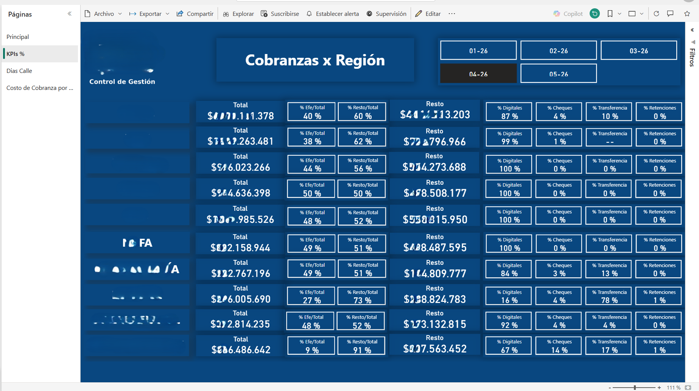

**Question answered:** *Which region is most reliant on cash, and is the
digital payment mix shifting month over month?*

| Metric | DAX measure |
|---|---|
| Total collected ($) | `SUM(Cobranzas[TOTAL])` |
| % Cash / Total | `[% Efe/Total]` |
| % Rest / Total | `[% Resto/Total]` |
| % Digital | `[% Digitales]` *(BIND + Mercado Pago + PayPerTic)* |
| % Checks | `[% Cheques]` |
| % Bank transfers (2 entities) | `[% Transferencia]` |
| % Tax withholdings | derived from total |

**Decision enabled:** Treasury can spot a single-method drop (e.g., a
processing-gateway outage on Mercado Pago) within hours instead of at
month-end. Regional cash-richness highlights where to deploy more
field-collection vendors.

#### 1.2 Days Outstanding (DSO)
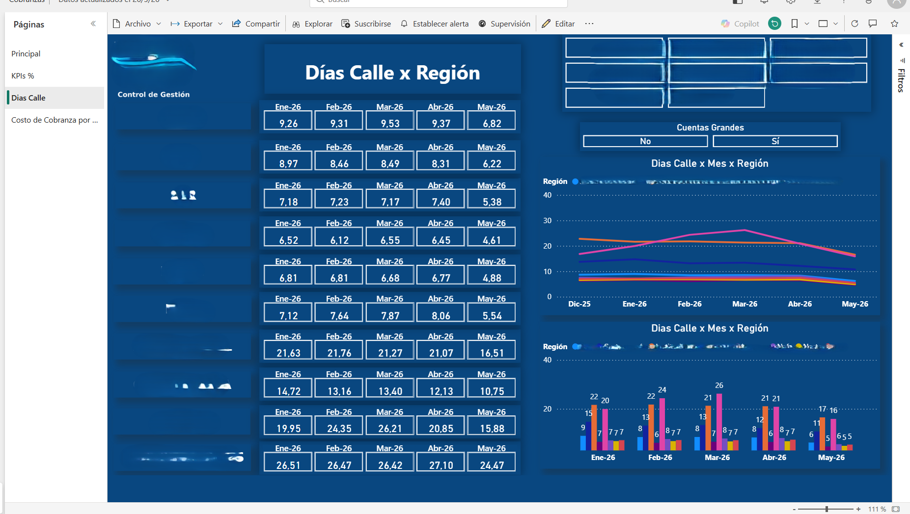

**Question answered:** *How many days does it take, on average, to
collect on a sale — by region, by month, segmented by account-size tier?*

Top section shows DSO per region as a 5-month trend grid (Jan-26 → May-26).
Bottom section overlays a regional trend chart for the same window,
followed by an account-size split (Cuentas Grandes Sí/No).

**DAX measure:** `[Dias Calle] = DIVIDE([Deuda Total], DIVIDE([Ventas Netas], [Dias Trabajados]))`

**Decision enabled:** A region where DSO trends upward over consecutive
months indicates a credit-policy issue or a customer-segment quality
problem that needs intervention before bad debt accumulates.

#### 1.3 Collection Cost per Vendor
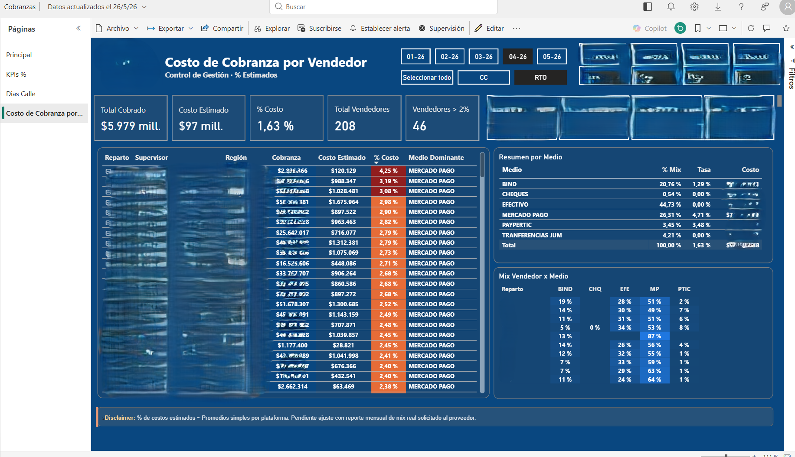

**Question answered:** *Which vendors are driving collection cost
above tolerance, and which payment methods dominate their mix?*

| KPI card | Calculation |
|---|---|
| Total Cobrado | `SUM(Cobranzas[TOTAL])` excluding withholdings |
| Costo Estimado | `[Costo Cobranza]` (SUMX × cost rate per method) |
| % Costo | `[% Costo / Cob. Real]` |
| Total Vendedores | distinct count |
| Vendedores > 2% | `[Vendedores sobre Umbral]` |

The grid ranks vendors descending by % cost. Conditional formatting
highlights those above tolerance. The "Medio Dominante" column uses
`[Medio Dominante]` measure to display the leading payment method per
vendor (`ADDCOLUMNS + TOPN + MAXX` pattern).

**Decision enabled:** Targeted vendor-level coaching. A vendor whose mix
is heavy on high-cost methods (BIND, Mercado Pago) is either coached on
incentivizing cash, or their territory is re-evaluated.

**SQL source:** [`sql/07_collections/cobranzas_mensuales_por_ruta.sql`](../sql/07_collections/)

---

### 2 · F/C Equipment Retention Workflow
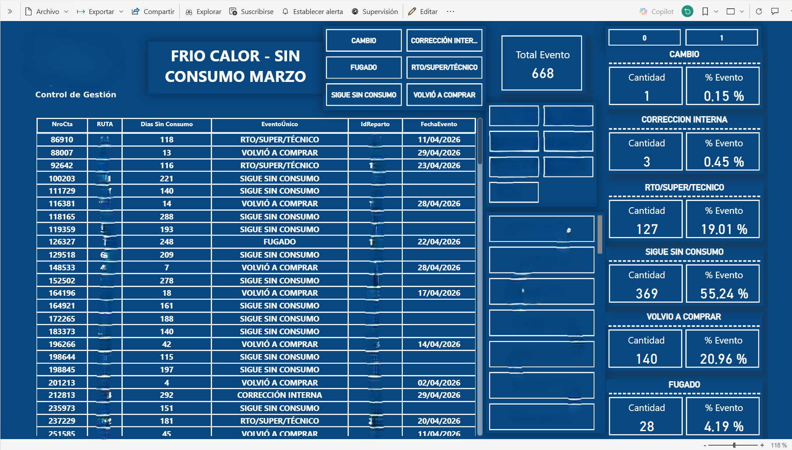

**Question answered:** *Of the customers with installed cold/hot water
equipment who haven't ordered in 60+ days, what happened this month —
did they come back, retrieve the equipment, or go silent?*

Right-side cards display the event distribution: CAMBIO (equipment swap),
CORRECCIÓN INTERNA (internal adjustment), RTO/SUPER/TÉCNICO (standard
retrieval), SIGUE SIN CONSUMO (still inactive), VOLVIÓ A COMPRAR
(reactivated), FUGADO (escaped without paying). Center grid lists each
account with its assigned route, days without consumption, event
classification and date.

**Decision enabled:** Operations triages the cohort daily. Customers in
"FUGADO" status are escalated to legal. Customers in "SIGUE SIN CONSUMO"
with >120 days get a retention call. Equipment retrievals are prioritized
for routes with the longest queue, maximizing fleet utilization.

**SQL source:** [`sql/02_retention/frio_calor_sin_consumo_60.sql`](../sql/02_retention/)

---

### 3 · Cross-selling Performance
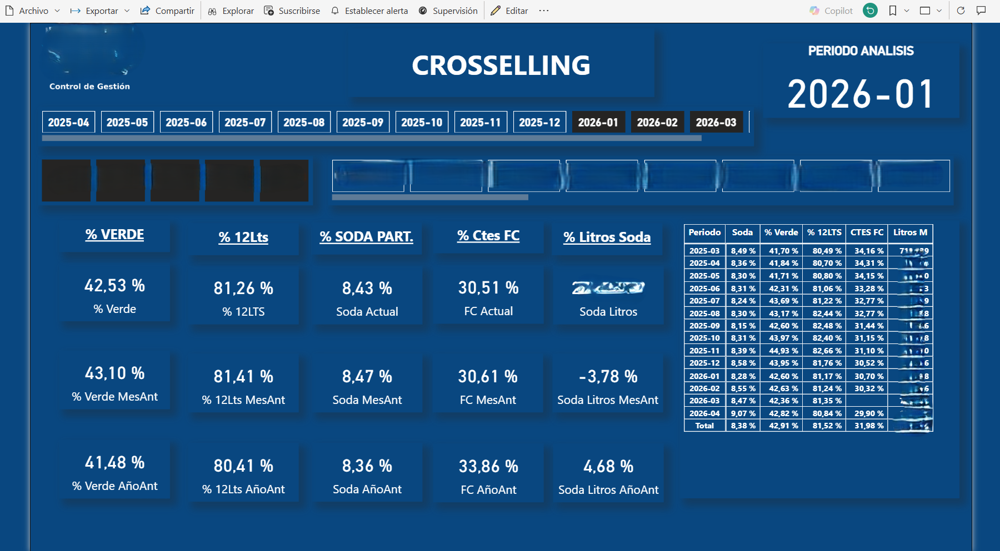

**Question answered:** *Are we successfully migrating customers from
basic bottles to the premium product mix (12L, soda, FC equipment)?*

| KPI | Definition |
|---|---|
| % Verde | Premium-grade bottle adoption |
| % 12Lts | Larger-bottle adoption (margin-positive) |
| % SODA PART. | Soda-product participation in mix |
| % Ctes FC | % of customers with installed F/C equipment |
| Soda Litros | Volumetric weight of soda in total liters |

Each KPI displays current month, previous month, and prior-year same-month
for trend identification. The right-side detail table tracks the 5 KPIs
over 14 months.

**Decision enabled:** Marketing measures campaign lift on premium products.
Trade Marketing identifies regions where adoption is below national average
and deploys targeted promotions.

---

### 4 · Holiday Sales Recovery
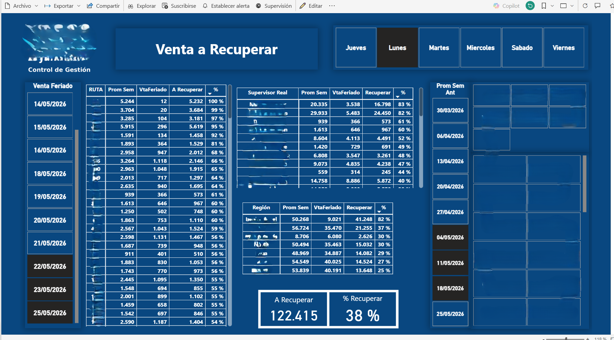

**Question answered:** *How much revenue do we need to recover the day
after a holiday — by route?*

| Metric | Definition |
|---|---|
| Prom Sem | weekly average sales for the same weekday |
| VtaFeriado | actual sales on the holiday |
| A Recuperar | difference (revenue gap to close) |
| % | recovery percentage = A Recuperar / Prom Sem |

The dashboard slices by holiday date (calendar pane left), by weekday
selector (top), and by supervisor / region (right pane), enabling
planning around movable holidays.

**Decision enabled:** Operations rebalances next-day delivery capacity to
the most-impacted routes. Sales targets are adjusted: the day after the
holiday is not a normal Tuesday — it's "Tuesday + recovery of last Tuesday."

**SQL source:** [`sql/08_daily_operations/feriados_venta_a_recuperar.sql`](../sql/08_daily_operations/)

---

### 5 · Customer Acquisitions — RTO / Digital (2 pages)

A two-page report tracking new customer acquisitions: counts of new
clients on page 1, water-volume consumed by those new clients on page 2.

#### 5.1 Daily acquisitions grid
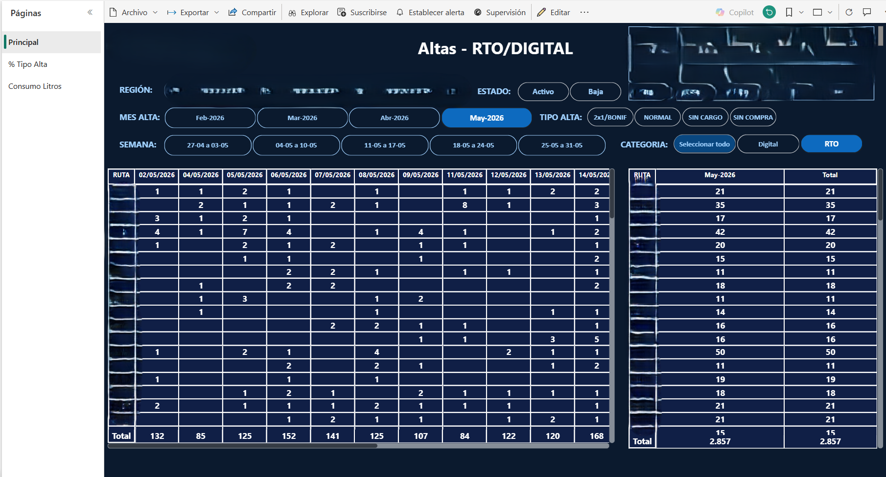

**Question answered:** *Where (which route) and how (Digital vs Traditional)
are we acquiring new customers this month, and what promo brought them in?*

| Filter | Values |
|---|---|
| REGIÓN | 7 regions including Gastronomía |
| ESTADO | Activo · Baja |
| MES ALTA | last 4 months |
| SEMANA | week-of-month |
| TIPO ALTA | 2x1/BONIF · NORMAL · SIN CARGO · SIN COMPRA |
| CATEGORIA | Digital · RTO |

The grid shows day-by-day acquisitions per route. Side panel shows
month totals per route, with a grand-total row at the bottom.

#### 5.2 Consumption by acquisition cohort
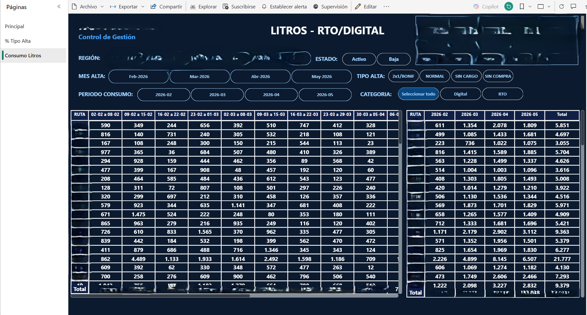

**Question answered:** *Of the customers we acquired in month X, how
many liters did they consume in subsequent weeks?*

Side-by-side: left grid shows liters per route × week-of-acquisition,
right grid shows the same data aggregated by month.

**Decision enabled:** Marketing distinguishes between *vanity acquisitions*
(high alta count, low subsequent consumption) and *true acquisitions*
(steady consumption pattern). A cohort that registers but drops to zero
liters by week 4 indicates a promo-shopping pattern rather than a real
customer relationship.

**SQL source:** [`sql/01_acquisition/altas_digital_rto.sql`](../sql/01_acquisition/)
+ [`sql/01_acquisition/altas_concretadas_gastro.sql`](../sql/01_acquisition/)

---

### 6 · Route Statistics — Estadísticas Repartos (2 pages)

A two-page route-level operations report tracking volume (liters)
and revenue ($) by route, with month-over-month and year-over-year
variation.

#### 6.1 Liters by route
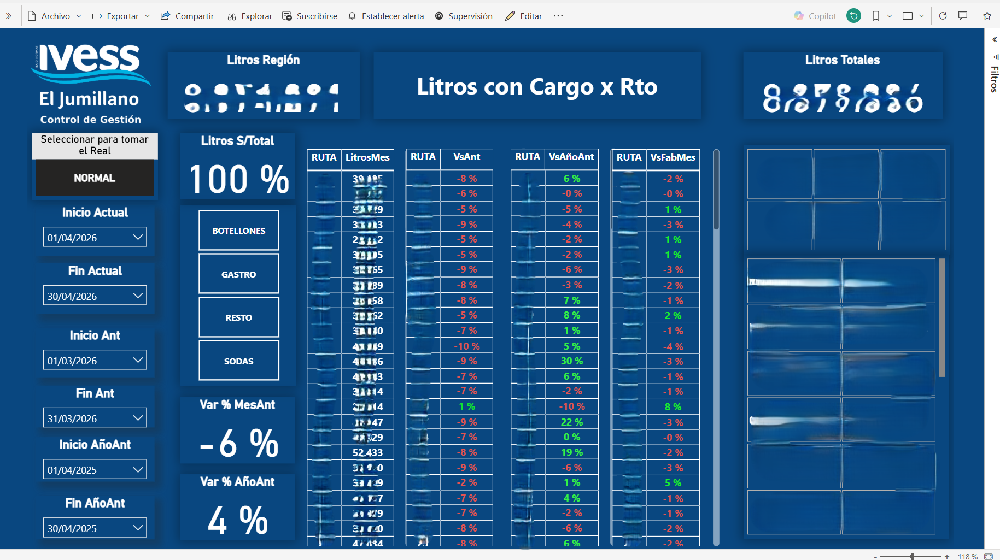

**Question answered:** *Which routes are growing or shrinking in liters
shipped, comparing current month vs previous month vs same month last year?*

Top KPIs: Litros Región, Litros con Cargo x Rto, Litros Totales. Center
grid shows per-route liters with three variance columns (vs previous
month, vs prior-year, vs factory benchmark). Color coding makes
out-of-tolerance variances visible at a glance (red <-5%, green >+5%).

#### 6.2 Revenue by product family
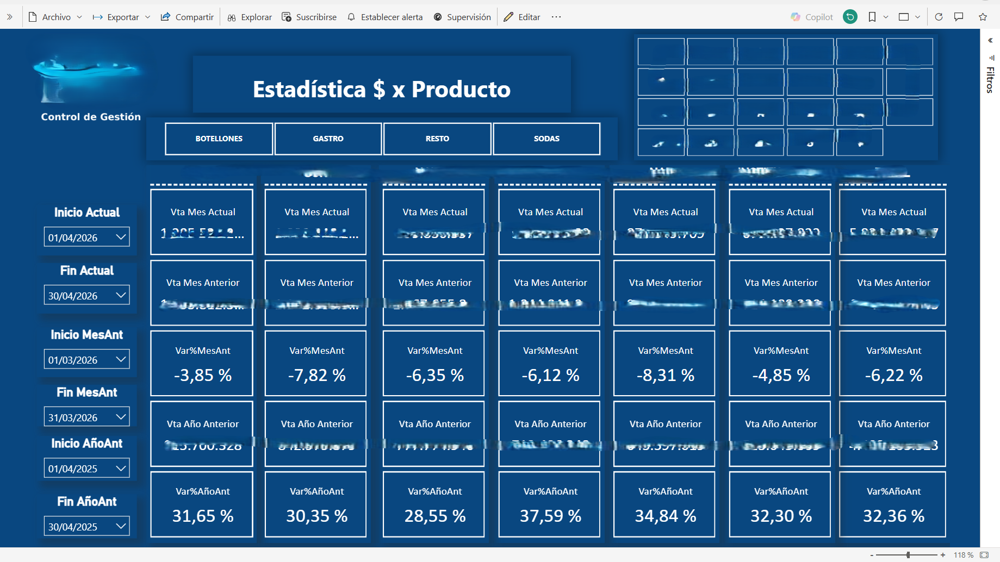

**Question answered:** *How is revenue distributed across product
families (Bottles, Gastro, Rest, Sodas), and how is each family
trending?*

Four product-family columns. Each shows current month, previous month,
prior year, with both absolute amount and % variance. Allows quick
identification of which family is dragging the total down.

---

### 7 · Gated Community Soda Promotion — Barrios
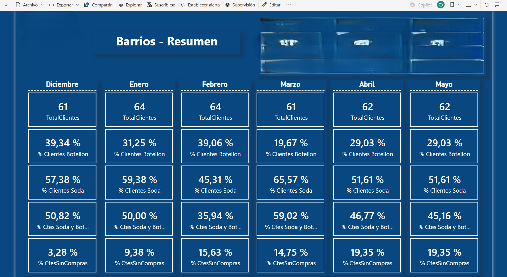

**Question answered:** *How is the soda-cross-sell campaign in private
gated communities (barrios cerrados) performing month over month?*

Six-month KPI grid (one column per month) with five rows per month:
- **TotalClientes** — population size in barrios cerrados
- **% Clientes Botellón** — bottle-only customers
- **% Clientes Soda** — soda customers (target metric)
- **% Ctes Soda y Botellón** — cross-sold customers (best customers)
- **% Ctes SinCompras** — inactive customers

**Decision enabled:** Marketing tracks the trajectory of the soda
cross-sell campaign in this high-value segment. A rising % SinCompras
flags geographic or operational issues with reaching these closed
communities.

**SQL source:** [`sql/05_segmentation/clientes_barrios_cerrados.sql`](../sql/05_segmentation/)

---

## DAX measures

14 representative measures from the Collections module, organized in
6 themed sections, are documented in [`measures.dax`](measures.dax).

Patterns demonstrated:
- **`CALCULATE` + `FILTER` + `ALL`** for OR-logic filters (multiple methods
  treated as one group)
- **`VAR` / `RETURN`** for legibility in multi-step calculations
- **`ADDCOLUMNS` + `TOPN` + `MAXX`** for "winner of the context" analyses
- **Context transition** inside `ADDCOLUMNS` — re-evaluating a measure per
  virtual row
- **`REMOVEFILTERS`** to compute totals immune to slicer filters
- **`SUMX` + `RELATED`** for line-by-line cost weighting
- **`DIVIDE` with alternate result** to handle division-by-zero gracefully

## Power Query M

The M code that materializes each dashboard's underlying tables is being
migrated to this folder. Selection criterion: M queries that demonstrate
non-trivial transformations (custom columns with conditional logic,
list operations, type inference, joins across multiple SQL CTEs).

The data source is parameterized so the same M code works against
production and the synthetic demo (`H2O_JUMI_DEMO`).

---

## Reproducing these dashboards locally

1. Follow the [`data/README.md`](../data/README.md) instructions to load
   the synthetic dataset into a local SQL Server.
2. Open Power BI Desktop → **Get Data → SQL Server** → point to your local
   instance.
3. Copy the SQL queries from `sql/0X_*` folders into Power BI as Native
   Query data sources.
4. Apply the DAX measures from [`measures.dax`](measures.dax).
5. Build visuals matching the screenshots above — the layout choices
   themselves are part of the design value (mobile-readable card grid,
   color-coded conditional formatting, navigation pane with sub-views).
